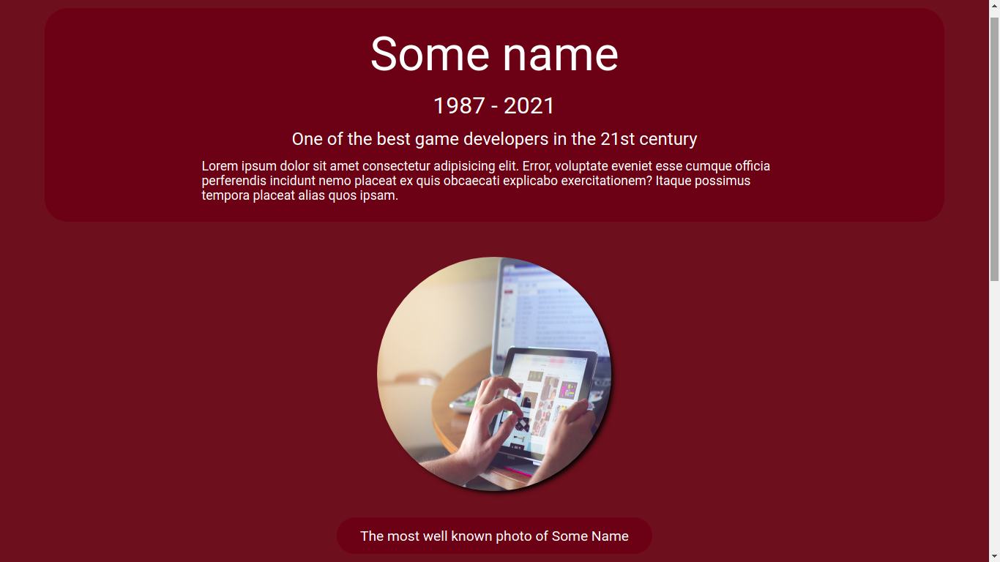
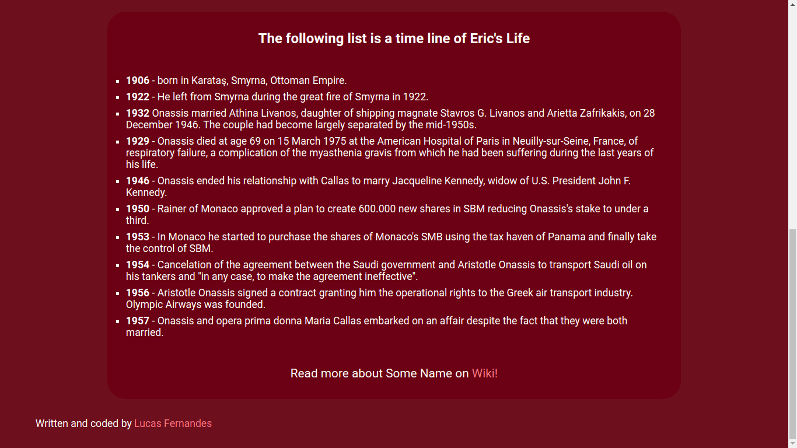

<p align="center">
  <h3 align="center">Simple Tribute Page</h3>

  <p align="center">
    A simple tribute page!
    <br />
    <a href="https://github.com/LucFerSan/tribute-page"><strong>Explore the docs »</strong></a>
    <br />
    <br />
    ·
    <a href="https://github.com/LucFerSan/tribute-page/issues">Report Bug</a>
    ·
    <a href="https://github.com/LucFerSan/tribute-page/issues">Request Feature</a>
  </p>
</p>

## About The Project



A simple and responsive tribute page, just for the sake of practicing basic html and cdss.

### Built With

- [Html](https://developer.mozilla.org/pt-BR/docs/Web/HTML)
- [Css](https://developer.mozilla.org/pt-BR/docs/Web/CSS)

### Installation

1. Clone the repo
   ```sh
   git clone https://github.com/LucFerSan/tribute-page.git
   ```

## Usage

<p float="left">
  
   
</p>

## Contributing

Contributions are what make the open source community such an amazing place to be learn, inspire, and create. Any contributions you make are **greatly appreciated**.

1. Fork the Project
2. Create your Feature Branch (`git checkout -b feature/AmazingFeature`)
3. Commit your Changes (`git commit -m 'Add some AmazingFeature'`)
4. Push to the Branch (`git push origin feature/AmazingFeature`)
5. Open a Pull Request

## License

Distributed under the MIT License. See `LICENSE` for more information.

## Contact

Lucas Fernandes - fernandes.lucas11@outlook.com

Project Link: [https://github.com/LucFerSan/tribute-page](https://github.com/LucFerSan/tribute-page)

### Special thanks to

- [GeeksForGeeks](https://www.geeksforgeeks.org/top-10-projects-for-beginners-to-practice-html-and-css-skills/)
